 

 

   

 

<a href="#01-profile">Profile</a> &nbsp;&nbsp;·&nbsp;&nbsp; <a href="#02-currently-building">Building</a> &nbsp;&nbsp;·&nbsp;&nbsp; <a href="#03-featured-work">Featured Work</a> &nbsp;&nbsp;·&nbsp;&nbsp; <a href="#04-how-i-build">How I Build</a> &nbsp;&nbsp;·&nbsp;&nbsp; <a href="#05-stack">Stack</a> &nbsp;&nbsp;·&nbsp;&nbsp; <a href="#06-experience">Experience</a> &nbsp;&nbsp;·&nbsp;&nbsp; <a href="#07-research">Research</a> &nbsp;&nbsp;·&nbsp;&nbsp; <a href="#08-activity">Activity</a>

 

## 01 Profile

I build AI systems that run where the data lives.

Most of my recent work is local-first inference: a FastAPI service in front of Ollama, a vector store on disk, and correctness enforced by deterministic code rather than by prompt wording. The repositories below also carry everything around the model, React and React Native front ends, Postgres schemas with row-level security on every table, Terraform and Kubernetes, and CI that fails on evaluation regressions instead of only on lint.

The constraint I design against most often is a hard one. Nikki is tuned to fit chat, embeddings, speech-to-text, text-to-speech and voice conversion inside a 6 GB GPU, and the tradeoffs are documented in the config file next to the eval results that justified them.

<table>
<tr>
<td width="33%" valign="top">

**What recruiters notice**

Production surface area across the whole stack. Docker, Terraform, Kubernetes, GitHub Actions and evaluation gates ship inside the projects, not as a separate checklist.

</td>
<td width="33%" valign="top">

**What founders notice**

Products that work end to end. Onboarding, offline fallbacks, billing, auth, and honest failure states are built in, and scope cuts are written down rather than hidden.

</td>
<td width="33%" valign="top">

**What engineers notice**

Decisions with receipts. Model choices, latency numbers and VRAM budgets are recorded in comments and eval suites, so the reasoning survives after the commit.

</td>
</tr>
</table>

## 02 Currently Building

| Focus | What it is | Status |
|:--|:--|:--|
| [**Nikki AI Companion**](https://github.com/Naresh23032003/Nikki-AI-Companion) | Self-hosted companion with long-term memory, voice calls and a WhatsApp bridge, running fully offline | Active |
| [**Pocket Professor**](https://github.com/Naresh23032003/Pocket-Professor) | Voice-first spaced repetition that turns YouTube and PDFs into graded spoken quizzes | Active |
| [**Insight Pulse**](https://github.com/Naresh23032003/insight-pulse) | Next.js SaaS on AWS EKS, provisioned with Terraform and shipped by GitHub Actions | Active |
| [**naresh-ai.com**](https://naresh-ai.com) | Personal site, served from [naresh-portfolio](https://github.com/Naresh23032003/naresh-portfolio) on GitHub Pages | Live |

On the roadmap in those repos: caption-less video transcription fallback, visual ingestion for equations and diagrams, hands-free voice-activity submission, and a "teach it back" free-explanation grading mode.

## 03 Featured Work

### [Nikki AI Companion](https://github.com/Naresh23032003/Nikki-AI-Companion)

   

A private, self-hosted AI companion that runs entirely on your own machine: streaming chat, long-term memory across sessions, voice notes, hands-free calls with a lip-synced avatar, and a WhatsApp bridge, all inside a 6 GB GPU budget.

| Layer | Choice |
|:--|:--|
| **Core** | Python, FastAPI, Ollama, ChromaDB, SQLite, React PWA on Vite |
| **Voice** | faster-whisper, Kokoro TTS, RVC voice conversion, XTTS-v2, Demucs |
| **Delivery** | Multi-stage Dockerfile, one-command Compose lite tier, GitHub Actions CI |

- **Two-brain routing.** Everything personal stays local. An optional cloud tier (Groq, then Gemini, then Cerebras) handles genuinely hard work, is budget-aware against free-tier limits, kill-switchable from config, and appends every outbound payload to an audit log.
- **Guards live in code, not in prompts.** Replies claiming actions that never ran are regenerated, price and news claims with no tool behind them are stripped, and a mention is distinguished from a request everywhere.
- **Deterministic evals gate every push.** Router 64 of 64, tone guards 10 of 10, temporal memory 9 of 9, journal patterns 8 of 8, all runnable with no model in the loop.
- **Documented tradeoffs.** Model selection, keep-alive tuning and VRAM headroom are argued in `config.yaml` against measured failures, and RVC call latency was cut from about 2000 ms to about 300 ms per chunk by caching the pitch model and reusing one connection.
- **Degrades honestly.** Voice and ML libraries are lazy-imported so the lite image boots without them, a stuck studio render times out and falls back, and a rate-limited cloud call becomes a deferred task instead of an invented answer.

 

### [Pocket Professor](https://github.com/Naresh23032003/Pocket-Professor)

   

A voice-first learning companion. Paste a YouTube link or a PDF, get structured notes and atomic flashcards, then answer out loud in short daily sessions while an LLM grades the substance of what you said.

| Layer | Choice |
|:--|:--|
| **App** | Expo, React Native, TypeScript, Expo Router, Zustand, Reanimated |
| **Backend** | Supabase auth, Postgres, storage and edge functions written in Deno TypeScript |
| **Models** | Groq: Llama 3.3 70B for card generation, Llama 3.1 8B for grading, Whisper large-v3-turbo for speech |

- **Real spaced repetition.** FSRS scheduling through `ts-fsrs` at 0.9 target retention, computed client-side with state persisted to Postgres.
- **A quiz loop as a state machine.** `use-quiz-session.ts` drives ask, listen, grade and feedback, with a sub-2.5 second feedback budget and tap-to-override grades.
- **Row-level security on every table.** Migrations define the policies, and the Groq key never leaves an edge function.
- **Fully usable muted.** Every spoken interaction has a text twin, so the product works without audio rather than degrading into nothing.
- **Scope stated openly.** The README names what is deliberately out of this version, including payments and visual ingestion, instead of implying they exist.

 

### [Insight Pulse](https://github.com/Naresh23032003/insight-pulse)

   

A monorepo SaaS build that takes a Next.js application all the way to a managed Kubernetes cluster, with the infrastructure defined as code rather than clicked together.

| Layer | Choice |
|:--|:--|
| **App** | Next.js 16, React 19, TypeScript, Tailwind CSS v4, Clerk auth, Stripe checkout and webhooks |
| **Infrastructure** | Terraform: VPC with private subnets, EKS 1.31, managed node groups that scale 1 to 3 |
| **Pipeline** | GitHub Actions builds the image, pushes to ECR, then patches the Kubernetes deployment by commit SHA |

- **Immutable image tags.** Every deploy is pinned to the commit SHA, so a rollback is a tag change rather than a rebuild.
- **Private-subnet cluster.** Nodes sit in private subnets from the Terraform VPC module, with endpoint access configured explicitly.
- **Billing wired end to end.** Checkout sessions and Stripe webhooks are real route handlers, not placeholders.

 

### [GenAI-Driven Intelligent Email Ticketing](https://github.com/Naresh23032003/GenAI-Driven-Intelligent-Email-Ticketing)

   

Support-inbox triage that parses incoming email, scores sentiment with rule-based detection plus a locally hosted Llama 3, maps complaints onto an issue dictionary, and routes each ticket to the responsible team behind a Streamlit analytics dashboard.

| Layer | Detail |
|:--|:--|
| **Stack** | Python, Streamlit, Ollama Llama 3, SQLAlchemy, NLTK, scikit-learn, pandas |
| **Data** | A 500-email sample dataset ships with the repo so the pipeline is reproducible |
| **Outcome** | Basis for a paper accepted at ICACECS 2025, published by Springer Nature |

 

<b>More repositories</b>

 

| Repository | What it is | Stack |
|:--|:--|:--|
| [naresh-portfolio](https://github.com/Naresh23032003/naresh-portfolio) | The site behind [naresh-ai.com](https://naresh-ai.com), a single hand-written page on GitHub Pages with a custom domain | HTML, CSS |
| [portfolio](https://github.com/Naresh23032003/portfolio) | Full-stack portfolio build with a typed API layer and a component system | React 19, Vite, Express 5, Drizzle ORM, Postgres, Tailwind, Radix UI, Framer Motion |
| [PDF-Chat](https://github.com/Naresh23032003/PDF-Chat) | Question answering over uploaded PDFs, an early retrieval build | Streamlit, LangChain, PyPDF2, Google Generative AI |
| [Gender-Classification](https://github.com/Naresh23032003/Gender-Classification) | Image classifier trained from scratch, written as a readable notebook | PyTorch, torchvision |
| [Sentiment Analysis and Text Feature Extraction](https://github.com/Naresh23032003/Sentiment-Analysis-and-Text-Feature-Extraction-of-Online-Content) | Scraping and NLP feature pipeline over online content, with a written report | Python, BeautifulSoup, NLTK, pandas |
| [Automated-grading-and-feedback](https://github.com/Naresh23032003/Automated-grading-and-feedback) | Descriptive-answer grading platform with separate instructor and student portals | PHP, MySQL, Python, FPDF |
| [Startup-Profit-Prediction](https://github.com/Naresh23032003/Startup-Profit-Prediction) · [Linear-regression](https://github.com/Naresh23032003/Linear-regression) · [PCA](https://github.com/Naresh23032003/PCA) | Compact, single-purpose implementations of core ML techniques | Python, scikit-learn, NumPy |

## 04 How I Build

<table>
<tr>
<td width="50%" valign="top">

**Local first, cloud by exception**

Ollama, ChromaDB and SQLite are the default path in the AI repositories. When a hosted model is genuinely needed it is routed to explicitly, capped by a daily budget, logged to an audit file, and switchable off in one line.

</td>
<td width="50%" valign="top">

**Determinism where it matters**

Routing, guard behaviour and temporal logic are tested with no model in the loop, so CI can gate them on every push. Model-backed evals exist too, but behind a separate flag.

</td>
</tr>
<tr>
<td width="50%" valign="top">

**Constraints written down**

`config.yaml` in Nikki reads as a decision log. Each setting carries the measurement that produced it, including the VRAM figures that disqualified an otherwise better extraction model.

</td>
<td width="50%" valign="top">

**Graceful degradation by default**

Lazy imports let the lite image boot with no GPU stack. Render timeouts fall back to a faster engine. A failed cloud call becomes a queued task, never a fabricated answer.

</td>
</tr>
<tr>
<td width="50%" valign="top">

**Infrastructure as code**

Terraform describes the VPC and the EKS cluster. Kubernetes manifests live beside the app. Actions builds, pushes to ECR, and patches deployments by commit SHA.

</td>
<td width="50%" valign="top">

**Security in the schema**

Row-level security on every Supabase table, provider keys confined to edge functions, secrets in environment files that are excluded from the repository.

</td>
</tr>
</table>

## 05 Stack

Everything below appears in the repositories linked above.

**Languages**

**AI and LLM Systems**

        

**Backend and Frontend**

    

**Data and Storage**

  

**Machine Learning**

   

**Cloud, Infrastructure and Tooling**

   

## 06 Experience

| Role | Organisation | Period | Work |
|:--|:--|:--|:--|
| Forward Deployed Engineer | VaultStack AI, consulting engagement | Jun 2026 to present | On-premise, air-gapped RAG for financial compliance due diligence, running fully offline on self-hosted models. Hybrid dense and sparse retrieval with Docling table extraction, BGE-M3 and cross-encoder re-ranking, a deterministic scope planner resolved in code, and a verifier that traces every figure to source or abstains. |
| AI Decision Science Analyst | Accenture | Jan 2025 to Apr 2026 | Multi-agent decision platform for manufacturing and production planning, MILP supply chain tooling with CPLEX and Gurobi behind a Django and React stack, Databricks and Azure Data Factory pipeline remediation, and production-ready customer segmentation with PCA and clustering. |
| Product Development Intern | Razorpay | Jul 2024 to Oct 2024 | Automated personalised PDF report generation, integrated scripts for 200 or more merchants with A/B testing, and built an admin dashboard feature that removed about four hours of manual work per merchant. |
| Machine Learning Intern | TVS Electronics | May 2024 to Jul 2024 | Retrieval-augmented generation over service data on AWS Bedrock with Llama 3, plus an NLP cleaning pipeline and a Streamlit prototype for surfacing top solutions. |

Earlier: Generative AI Intern at Tecnod8, Software Development Intern at Razorpay, Summer Intern at Royal Enfield. Full history in the [resume](https://naresh-ai.com/resume.pdf).

**Education**

  

## 07 Research

| Paper | Venue |
|:--|:--|
| GenAI-Driven Intelligent Email Ticketing for Sentiment-Aware Customer Support &nbsp;·&nbsp; [code](https://github.com/Naresh23032003/GenAI-Driven-Intelligent-Email-Ticketing) | ICACECS 2025, Springer Nature, Smart Innovation, Systems and Technologies |
| Optimizing Delivery Operations in Dynamic Urban Environments: A Comprehensive Model | Society of Operations Management XXVII Annual International Conference, 2024 |
| Enhancing Sentiment Analysis on Amazon Reviews Using Ensemble Learning Models | International Journal of Innovative Research in Technology, 11(8), 2025 |
| Automated Assessment of Fruit Quality Using Transfer Learning and MobileNetV2 | International Journal for Research in Applied Science and Engineering Technology, 13(IV), 2025 |

## 08 Activity

<picture><source media="(prefers-color-scheme: dark)" srcset="https://github-profile-summary-cards.vercel.app/api/cards/profile-details?username=Naresh23032003&theme=github_dark"><source media="(prefers-color-scheme: light)" srcset="https://github-profile-summary-cards.vercel.app/api/cards/profile-details?username=Naresh23032003&theme=default"></picture>

  

<picture><source media="(prefers-color-scheme: dark)" srcset="https://github-profile-summary-cards.vercel.app/api/cards/repos-per-language?username=Naresh23032003&theme=github_dark"><source media="(prefers-color-scheme: light)" srcset="https://github-profile-summary-cards.vercel.app/api/cards/repos-per-language?username=Naresh23032003&theme=default"></picture> &nbsp;&nbsp; <picture><source media="(prefers-color-scheme: dark)" srcset="https://github-profile-summary-cards.vercel.app/api/cards/most-commit-language?username=Naresh23032003&theme=github_dark"><source media="(prefers-color-scheme: light)" srcset="https://github-profile-summary-cards.vercel.app/api/cards/most-commit-language?username=Naresh23032003&theme=default"></picture>

  

  

 

<picture><source media="(prefers-color-scheme: dark)" srcset="https://raw.githubusercontent.com/Naresh23032003/Naresh23032003/output/snake-dark.svg"><source media="(prefers-color-scheme: light)" srcset="https://raw.githubusercontent.com/Naresh23032003/Naresh23032003/output/snake-light.svg"></picture>

## 09 Contact

Open to conversations about applied AI systems, retrieval and evaluation, and full-stack product work.

 

  

  

